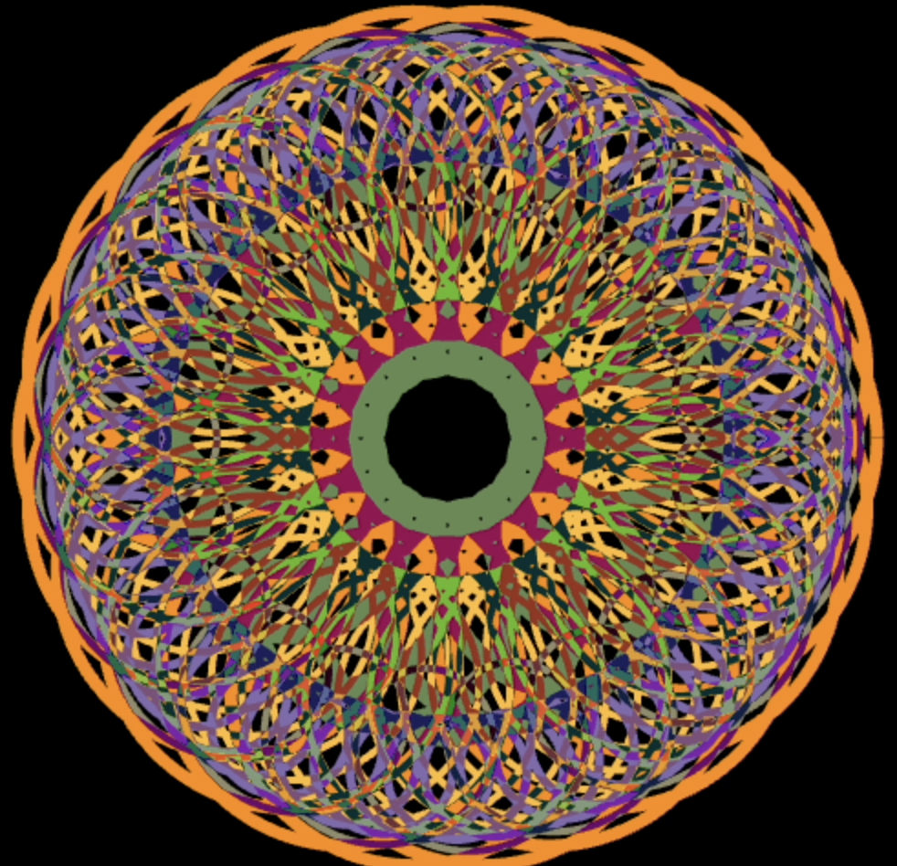

# Spirograph art

## How to use the app

Click "add new spirograph" to add a new spirograph, play around with the controls, make something cool. You can add as many spirographs as you like. Here's one I made that I enjoy

## Background

A spirograph is a geometric pattern made with two differently sized rings. The bigger ring has teeth on the inside, the smaller has teeth on the inside. The smaller ring is rolled around the bigger ring, with a pen held a certain distance away from the middle of the second ring, as shown below.

The equation of the line drawn is 

$$
\begin{align*}
x &= c_x + r_1 × cos(θ) + r_2 × cos(θ × ratio) \\
y &= c_y + r_1 × sin(θ) + r_2 × cos(θ × ratio),
\end{align*}
$$

where $c_x$ and $c_y$ are the $x$ and $y$ coordinateS of the center of the large circle, $θ$ is the angle to the center of the inside circle, $x$ and $y$ are the coordinates of the pen at angle $θ$, $r_1$ and $r_2$ are the distance from the center of the outside circle to the center of the inside circle and the radius of the inner circle respectively, and $ratio$ is the ratio of the number of teeth in the inside to the number of teeth on the outside. 

As $\theta$ goes from $0$ to $2\pi$ we get the path of the spirograph pattern.

## How it works

### Oscilation

A few extra parameters have been added to the above equation. There's a clock that increases every millisecond, and we use this to add an oscillattion to $r_1$. We also add some extra variables to control this oscilation. The equations used are:

$$
\begin{align*}
x &= c_x + r_1 \times (sin(t) \times k + r_o) \times cos(\theta) + r_2 \times cos(\theta \times ratio) \\
      y &= c_y + r_1 \times (sin(t) \times k + r_o) \times sin(\theta) + r_2 \times sin(\theta \times ratio),
\end{align*}
$$

where $t$ is the value of the clock, $k$ is the oscillator multiplier, or the amplitude of the oscillation, $r_o$ is the oscillator offset. By setting these values we can control the pulsing of the created spirograph patterns.

The offset variable applies a constant value to multiply the outer radius with. In practice this makes the spirograph oscillate around a non zero point, so the average radius will be equal to $r_1 \times r_o$.

The oscillator multiplier is the amplitude of the oscillation. Make it bigger and the spirograph will oscillate more, make it smaller and it will oscillate less. A value of 0 meanas there will be no oscillation at all, however the offset still applies.

### Colors

You can set the color of each spirograph by changing the rgba values. A feature of the HTML canvas element is that when two drawn lines overlap the color on top is subtracted from the color below and the absolute value is taken. This means that if we had a spirograph of `rgba(255,0,20,1)` drawn on top of a spirograph of `rgba(200,20,0,1)` we would get a resulting color of `rgba(55,20,0,1)` as we subtract the top from the bottom and take the absolute value. Another way of thinking about this would be to just subtract the bigger number from the smaller number.

This little quirk of canvases means you can make intricate and beautiful color patterns by overlaying different coloured spirographs on top of each other.

### Weight
This one's pretty strightforward, it's just the weight of the drawn line that makes up the spirograph.

## Credits

spirograph gif in this readme: CC-BY-SA [MichaelFrey](https://commons.wikimedia.org/wiki/User:MichaelFrey)

[this article](https://www.maissan.net/articles/javascript-spirograph) by Chris Maissan was a great help for providing a starting point for this app
